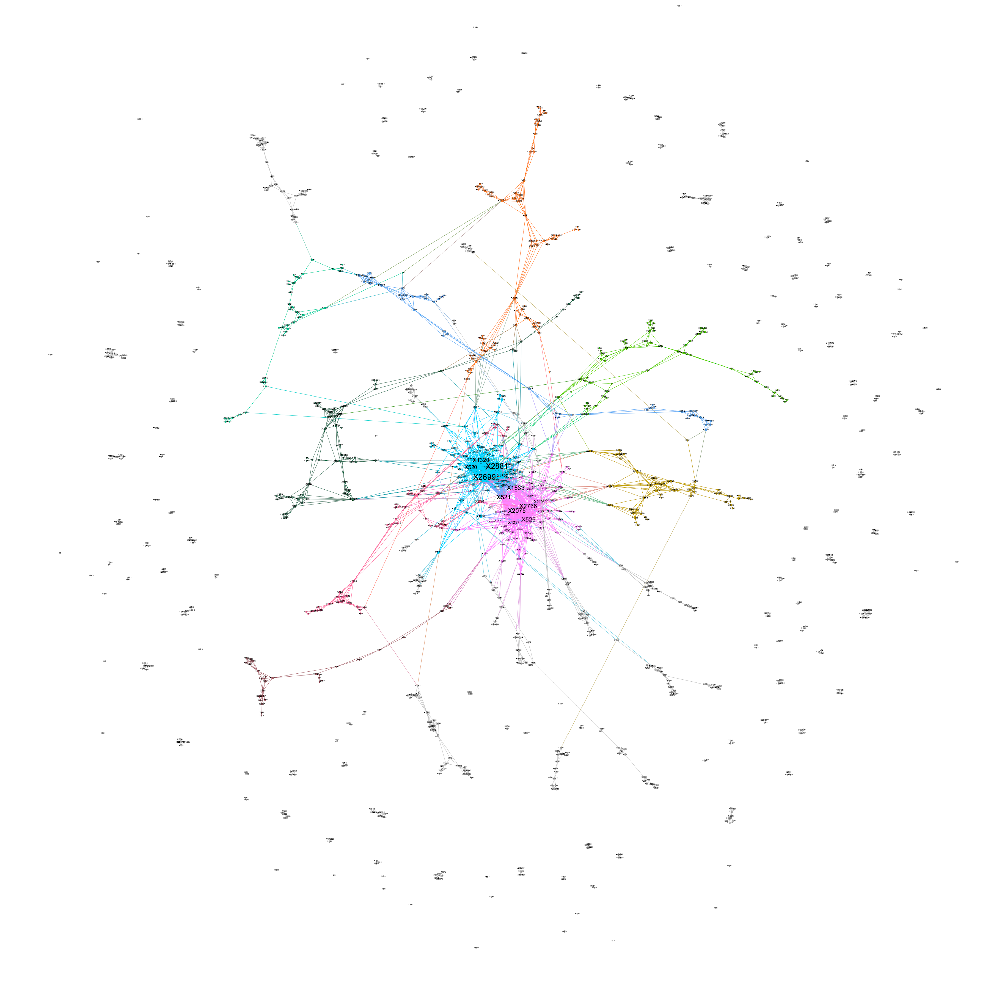
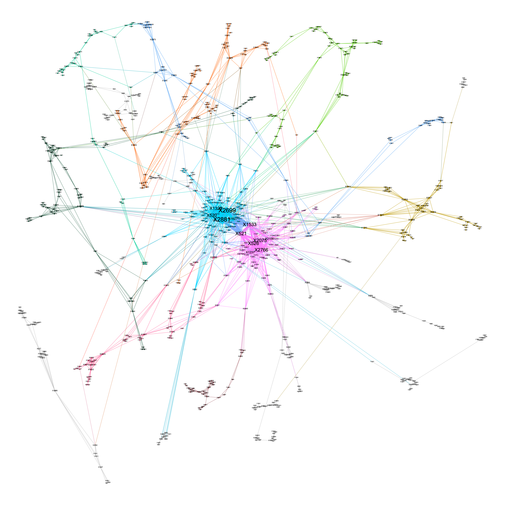

# Network Construction

## Network Construction Process

Below are the steps for calculating the "gene score" of each location that quantifies the degree of association between a base position and the disease/trait of interest. A higher score means a stronger association.

For each position $g$, we perform marginal regression and obtain a p-value, $p_g$. Every position then is assigned a score $\sigma(g) = -2log(p_g)$ (Vandin et al., 2012). Two positions share an edge if they occur together, and the edge weight is their co-occurrence number.

```{r}
# record p values for each position
mutations_pVal = c()
disease_status_vector = c(rep(1,n/2),rep(0,n/2)) # Arbitrarily assign the first half with disease

for (i in 1:length(position)){
  outcome <- "disease_status_vector"
  variable <- position[i]
  f <- as.formula(paste(outcome, 
        paste(variable), 
        sep = " ~ "))
  model <- lm(f, data = sub_data)
  mutations_pVal = c(mutations_pVal,summary(model)$coefficient[,4][2])
}

# compute score for each mutated position
mutations_score <- -2*log(mutations_pVal)
```


```{r}
edges <- melt(A) %>% 
  rename(Source = Var1, Target = Var2, Weight = value) %>%
  mutate(Type = "Undirected") %>% 
  select(Source, Target, Type, Weight) %>% 
  filter(Weight != 0)

nodes <- as.data.frame(colnames(sub_data)) %>%
  mutate(Label = colnames(sub_data))
colnames(nodes) <- c("Id","Label")

A.dat <- as.data.frame(A)
```

## Analysis

After revising our simulation methodology, we simulated using 3000 base positions and 500 samples to obtain the following graphs. 12 of the 15 previously identified SNP locations are chosen to be part of at least one genetic pathway: X520, X521, X526, X1237, X1320, X1533, X1627, X2075, X2106, X2699, X2766, and X2881. These 12 effective SNP locations form 4 causal pathways that lead to the disease:

1) X2699, X1320, X520, X2881

2) X2766, X1237, X2075, X521, X526

3) X526, X2766, X2106, X2075, X1533

4) X2699, X521, X2881, X1533, X1627

After a round of random mutations, we obtain 1187 mutated positions in total. This gives us an undirected weighted graph with 1187 nodes and 2838 edges, which produces an average degree of4.78. There is a single major component containing roughly 65% of its nodes. Expectedly, all causal pathways identified beforehand exist within this major connected component. Figure 4.1 shows the full graph, while Figure 4.2 shows its single major component. Using a resolution of 1, we obtained 25 modularity classes within the major connected component. The 12 selected positions are divided between two largest modules.


$$\text{Figure} \; 4.1 :\; \text{Full Network of Mutated Gene Base Positions}$$


$$\text{Figure} \; 4.2 :\; \text {Modularity Class Decomposition within the Major Connected Component, with Nodes Sized According to Closeness Centrality}$$

## Centrality Measures Report

Table 4.1 reports the top 12 nodes ranked by their degrees, eigenvector centrality, closeness centrality and betweeness centrality. The 12 effective disease-related positions selected are exactly the top 12 nodes with the greatest degrees and eigenvector centrality. This might be a result of the high degree of inter-connectivity among these positions. 

As a comparison, the $8^{th}$, $10^{th}$, and $12^{th}$ nodes with the highest closeness centrality are random variations, while 8 of the top 12 nodes with the greatest betweenness centrality are random variations.

Nodes colored blue below are random variables; nodes colored in red are nodes representing 12 SNP locations, where each is part of at least one combination.

```{r setup, include=FALSE}
knitr::opts_chunk$set(echo = TRUE)
```

```{r,echo= FALSE}
Rank = 1:12
Degree = c("X2699", "X2881","X521","X2075","X2766","X526","X1533","X520","X1320","X1237","X1627","X2106")
Eigen = c("X2881", "X2699","X521","X1533","X2075","X2766","X526","X520","X1320","X1627","X1237","X2106")

Closeness =c("X2881", "X2699","X1533","X520","X1320","X521","X2075","X2766","X526","X39","X1627","X1889")
Betweenness = c("X2881", "X2699","X1533","X807","X2083","X2438","X2251","X1301","X1806","X1739","X521","X571")
tab1=as.data.frame(cbind(Rank,Degree,Eigen,Closeness,Betweenness))
colnames(tab1) = c("Rank","Degree","Eigenvector Centrality","Closeness Centrality", "Betweeness Centrality")

dt = tab1
pathwaySNP = tab1$Degree

dt$Degree = cell_spec(dt$Degree, color = ifelse(dt$Degree %in%pathwaySNP, "red", "blue"))
dt$`Eigenvector Centrality` = cell_spec(dt$`Eigenvector Centrality`,color=  ifelse(dt$`Eigenvector Centrality` %in%pathwaySNP, "red", "blue"))
dt$`Closeness Centrality` = cell_spec(dt$`Closeness Centrality`, color = ifelse(dt$`Closeness Centrality` %in%pathwaySNP, "red", "blue"))
dt$`Betweeness Centrality` = cell_spec(dt$`Betweeness Centrality`, color = ifelse(dt$`Betweeness Centrality` %in%pathwaySNP, "red", "blue"))

kbl(dt, escape = F) %>%
  kable_styling()
```
\vspace{}
$$\text{Table 4.1: Top 12 nodes with the highest degree, eigenvector, closeness and betweenness centrality}$$

## Preliminary Conclusions

In this chapter, we found the exact 12 SNP locations that make up variant combinations. Network Science is powerful!

Here comes the question: Why don't we simply use degree centrality and eigenvector centrality to detect the SNP locations then? Why don't we stop here?

There are three reasons:

1. Our goal is to not only find which mutations cause diseases, but also which combinations cause diseases. The centrality measures we have do not allow us to infer the structure of the subnetwork of 12 nodes.

2. Our simulation uses co-occurrence counts to build edges, while in reality there could be more intrinsic ways to determine edges between SNPs.

3. We choose the top 12 nodes for centrality measures because we know the underlying truth that there should be 12 SNP locations from our simulation. It is difficult to find a cutoff without knowing the exact number of SNP locations involved, provided that a distinguishable gap in centrality measures (in this case, between 12th and 13th) does not exist.
