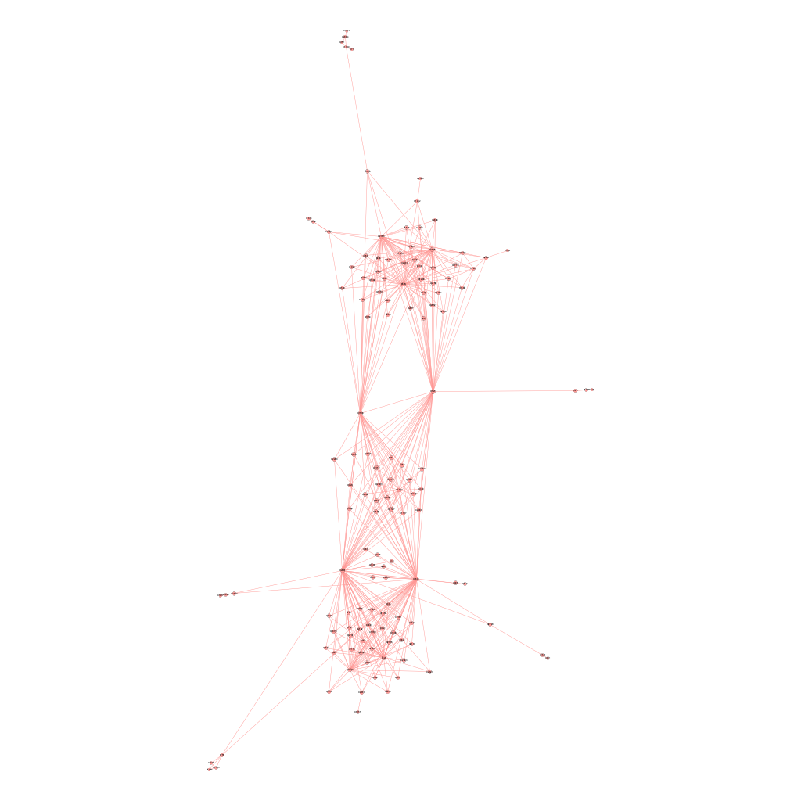
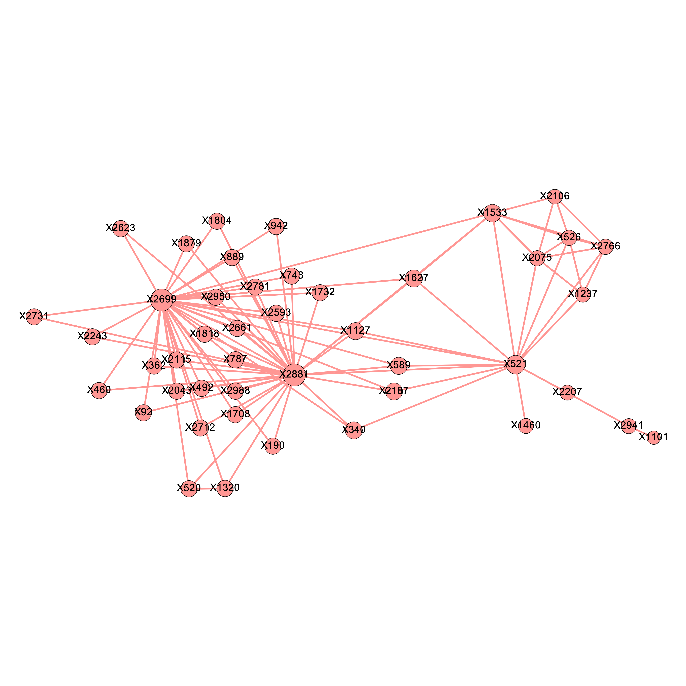
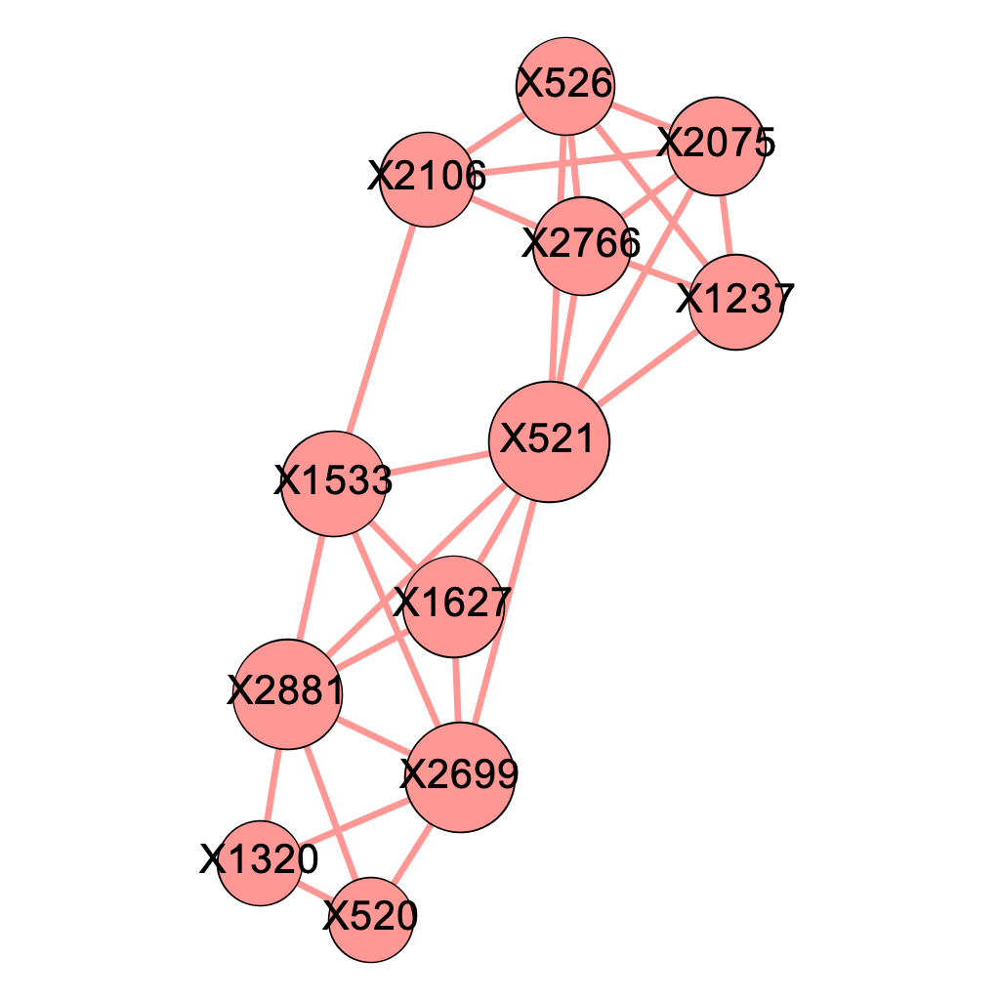
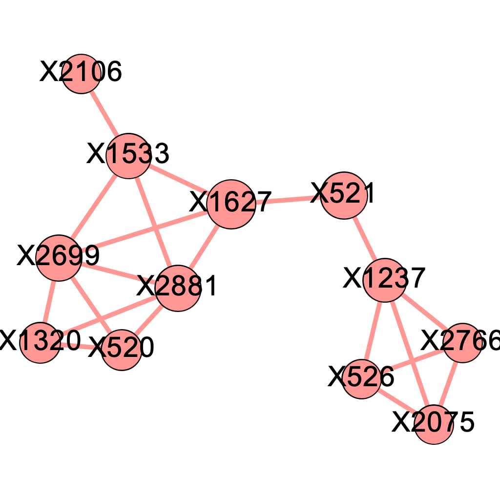
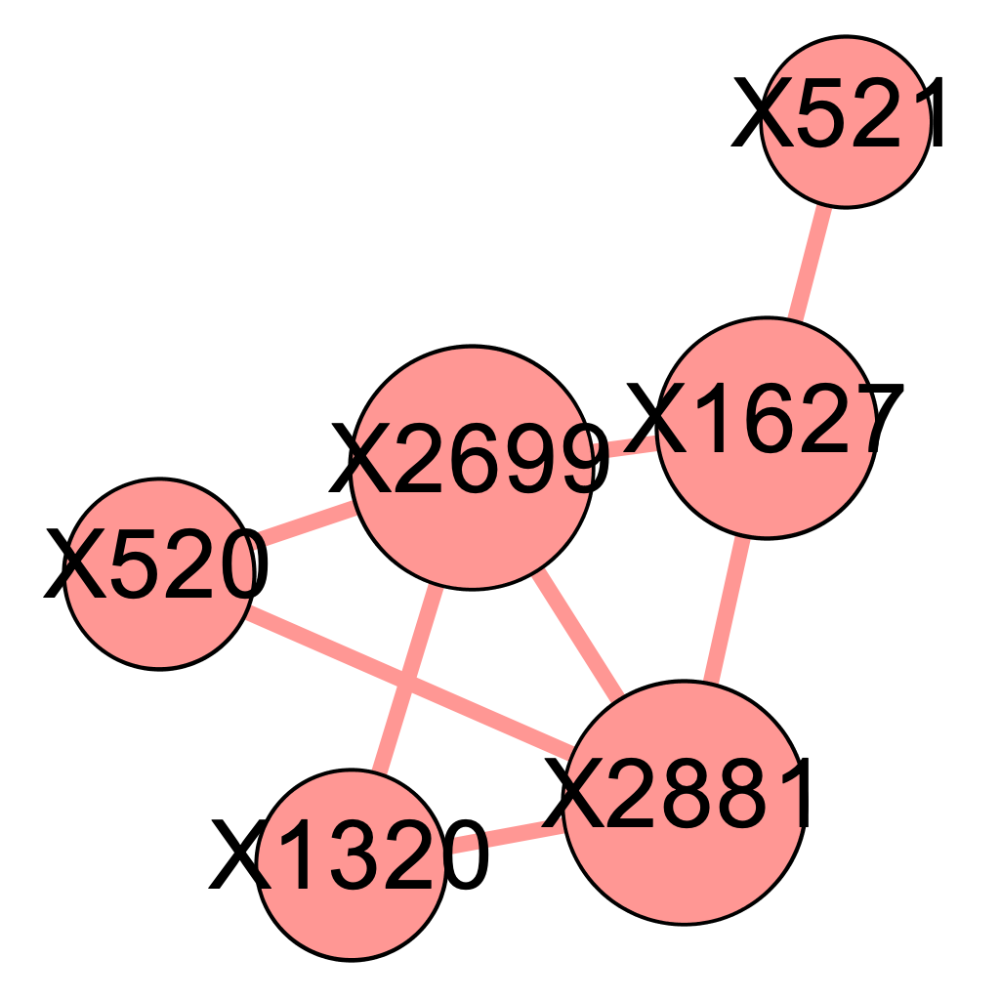
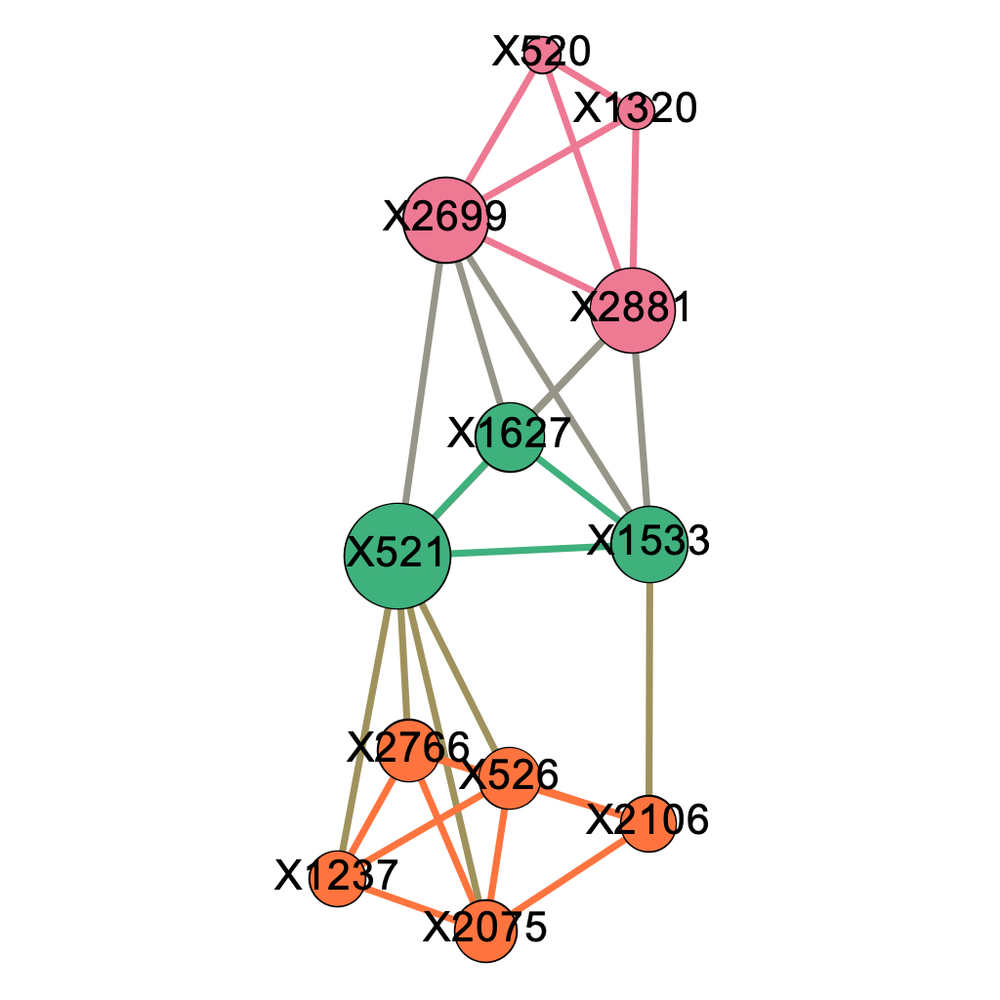
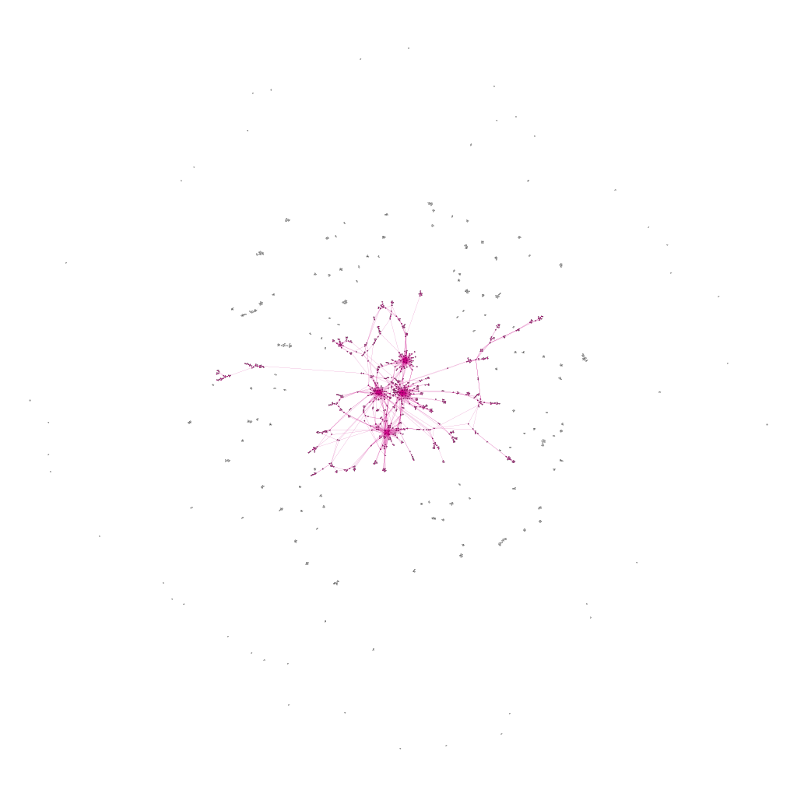
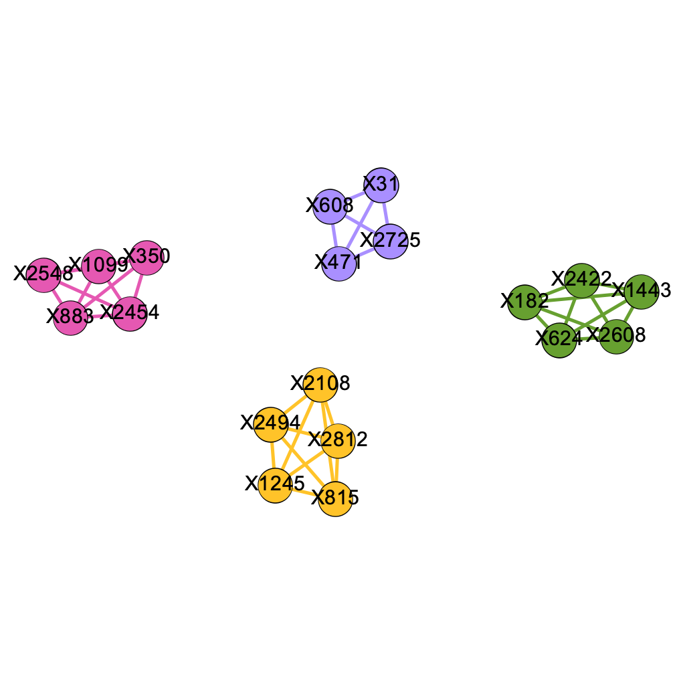

# Enhanced Influence Model

After constructing a network using our simulated data, we moved on to use the Enhanced Influence Model to identify significant subnetworks within the graph that shed light on genetic causal pathways. We will first introduce the graph diffusion kernel as the first step to measure the extent of mutual interaction between genes in our network.

## Graph Diffusion Kernel

Here we imagine that the importance of nodes flows along edges. Initially, query nodes are selected to serve as sources where fluid is pumped in at a constant rate which then diffuses through the network. In addition, we assume that fluid leaks out of each node at a constant rate $\gamma$. Intuitively, large $\gamma$ means faster rate of loss and therefore shorter diffusive paths. Essentially, the paths reflects diffusion of random walkers from a source. At equilibrium, there is no net flow in the entire network. The more interaction a node has with the query nodes, the more fluid it will contain at the equilibrium (Qi et al., 2008). Following the procedure in previous literature (Vandin, Upfal, and Raphael, 2011), we set $\gamma = 5$, which is approximately the average degree of a node in our network.

Mathematically,let $u(t)$ denotes the unit step function where $$u(t) = \begin{cases}0 \;\text{ if }\;t<0\\1 \;\text{ if }\;t>0 \end{cases},$$
and $b_i = 1$ if i is the source node of interest while $b_i = 0$ otherwise.

The amount of fluid contained by node $i$ at time t is $x_i(t)$ is governed by the flow in and out of it,

$$\frac{d}{dt}x_i(t) = \sum_j A_{ij}x_j(t)-\sum_jA_{ji}x_i(t)-\gamma x_i(t)$$
As $t\to \infty$, the fluid distribution approaches to its equilibrium distribution at which the influence of node $i$ to other nodes is measured by $$L_\gamma^{-1}\vec{b_i}$$
where $\vec{b_i}$ is the standard basis with 1 at its $i^{th}$ entry. Here, $L_\gamma = S-A+\gamma I$ is the shifted graph Laplacian by $\gamma$ where $S$ is the diagonal matrix whose diagonal entries are the corresponding degrees. In practice, we normalize A symmetrically by $S^{-\frac{1}{2}}AS^{-\frac{1}{2}}$ such that the edge weights between two nodes are normalized by the degrees and replace $S$ correspondingly to obtain the Laplacian (Qi et al. 2008). 

Here, the $ij$ entry of $L_\gamma^{-1}$ gives the influence of $j$ on $i$, which may or may not equal to the $ji$ entry of $L_\gamma^{-1}$. To better interpret the result, we define the mutual influence between i and j to be $\tilde{i}(i,j) = \min(L_\gamma^{-1}[i,j],L_\gamma^{-1}[j,i])$. (Vandin, Upfal, and Raphael, 2011)

## Enhanced Influence Model

Enhanced Influence Model is an efficient algorithm to identify a significantly mutated subnetwork with respect to gene interactions by incorporating considerations of both the topology of the network and significance of individual genes with respect to the disease (Vandin, Upfal, and Raphael, 2011). Below are the key procedures involved in the Enhanced Influence Model:

+ Recall from Chapter 4, marginal regression gives a p-value, $p_i$ for each gene $i$. We then assign a score $\sigma_i$ to a gene $i$ where $\sigma_i = -2\log(p_i)$.

+ For each pair of genes ($i$,$j$), their mutual interaction is measured by $w(i,j) = \max(\sigma_i,\sigma_j)*\tilde{i}(i,j)$ (Vandin et al., 2011). 

+ Next, we remove all edges with weights smaller than a threshold $\delta$ to obtain a subgraph. In Section 5.3, we shall exhibit a method to determine this cold-edge threshold $\delta$. The connected components remained are candidates for genetic pathways.

The code below shows how we construct the enhanced influence model from scratch.

```{r}
# normalize A
A_normalized <- matrix(0,nrow(A),nrow(A))

for(i in 1:(nrow(A)-1)){
  for(j in i:nrow(A)){
    if(deg[i]!=0 && deg[j]!=0){
      A_normalized[i,j] <- A[i,j]/sqrt(deg[i]*deg[j])
    }
  }
}

A_normalized <- forceSymmetric(A_normalized,"U")
A_normalized <- as.matrix(A_normalized)

# normalize the corresponding degree matrix S
S_normalized <- diag(rowSums(A_normalized))

gamma <- 5
L_gamma <- S_normalized+diag(gamma,nrow(A))-A_normalized
inv_L_gamma <- solve(L_gamma)
```

```{r}
# compute symmetric importance score using Enhanced Influence Model
W <- matrix(NA, nrow(A),ncol(A))
for(i in 1:(nrow(A)-1)){
  for(j in (i+1):nrow(A)){
    W[i,j] <- min(inv_L_gamma[i,j],inv_L_gamma[j,i])*max(mutations_score[i],mutations_score[j])
  }
}

```

```{r}
# helper function to remove cold_edge
removeColdEdge <- function(mat,W,delta){
  hotnet <- mat

  for(i in 1:(nrow(A)-1)){
    for(j in (i+1):nrow(A)){
      if(W[i,j]<delta){
        hotnet[i,j] = 0
      }
    }
  }
  return(hotnet)
}
```

```{r}
Hotnet <- removeColdEdge(A_normalized,W,0.04)
Hotnet <- as.matrix(forceSymmetric(Hotnet,"U"))
colnames(Hotnet) <- position
rownames(Hotnet) <- position
```

```{r}
HotEdges <- melt(Hotnet) %>% 
  rename(Source = Var1, Target = Var2, Weight = value) %>%
  mutate(Type = "Undirected") %>% 
  select(Source, Target, Type,Weight) %>% 
  filter(Weight != 0) %>%
  select(-Weight)
```

```{r}
edges.copy <- edges
edges.copy <- edges.copy %>%
  select(Source,Target)
colnames(edges.copy) <- c("from","to")

g <- graph_from_data_frame(edges.copy, directed=FALSE, vertices=nodes)

# get a list of connected components
clu <- components(g)
res <- groups(clu)
```

```{r}
getNumComp <- function(edges,nodes,s){
  edges.copy = edges
  edges.copy = edges.copy%>%select(Source,Target)
  colnames(edges.copy) = c("from","to")

  g <- graph_from_data_frame(edges.copy, directed=FALSE, vertices=nodes)
  clu <- components(g)
  res <- groups(clu)
  count <- 0
  
  for(i in 1:length(res)){
    if(length(res[[i]]) >= s){
      count = count+1
    }
  }
  return(count)
}
```

```{r, echo=FALSE, results='hide'}
# The number of components is 13.
getNumComp(HotEdges,nodes,3)
```

## Determine Value for Cold-Edge Threshold $\delta$

In this section, we illustrate a way to determine the value for $\delta$. We start with simulating 50 datasets under $H_0^P$ by permuting observed disease status. (Vandin et. al, 2012) Then, for a small value of $s$, where often $s \in \{3,4,5\}$, we choose the first $\delta$ that gives the largest number of subnetworks of size at least $s$. Given the size of our network, we use $s = 3$. Table 5.1 report the number of connected components of size at least 3 as a function of $\delta$.


```{r,echo=FALSE}
delta.lst = seq(0.01,0.09,0.01)
numComp.lst = c(100.3, 118.1,  50.2 , 10.5 ,  2.4 ,  2.4  , 2.4 ,  0.0 ,  0.0)
tab2=as.data.frame(rbind(delta.lst,numComp.lst))
colnames(tab2) = NULL
rownames(tab2) = c("delta value","Num.Components, Size>3")

kbl(tab2,  col.names = NA,escape = F) %>%
  kable_styling()%>%
kable_paper("striped",full_width = F)
```


According to Vandin (2012), an empirical choice is using a first $\delta$ that gives the maximum number of connected components of size at least 3, which gives $\delta = 0.02$ in our case. Since increasing $\delta$ gives us more conservative criteria, we also consider the following values: $1.5\delta = 0.03, 2\delta = 0.04, 3\delta = 0.06, 4\delta = 0.08$. In fact, if $\delta_1 >\delta_2$, then the connected components of size at least 3 obtained using $\delta_2$ will be a subnetwork of those obbtained using $\delta_1$.

For different $\delta$ values above, we construct graphs for the major component in each network, as shown by Figures 5.1 (a) - (e). In the ideal scenario, we expect that the major component contains and only contains the SNP locations involved in genetic pathways. This is one way that we could use to evaluate our results. 

Intuitively, as we raise the value for $\delta$, there will be more isolated nodes and the size of major component will decrease as it gets decomposed into smaller parts.

<center>
{
width=50% }
</center>
$$\text{Figure 5.1(a): Major component of the network of mutated genes when delta = 0.02}$$
$$\text{Nodes Sized by Closeness Centrality}$$

<center>
{
width=50% }
</center>
$$\text{Figure 5.1(b): Major component of the network of mutated genes when delta = 0.03}$$

<center>
{
width=50% }
</center>
$$\text{Figure 5.1(c): Major component of the network of mutated genes when delta = 0.04}$$

<center>
{
width=50% }
</center>
$$\text{Figure 5.1(d): Major component of the network of mutated genes when delta = 0.06}$$

<center>
{
width=40% }
</center>
$$\text{Figure 5.1(e): Major component of the network of mutated genes when delta = 0.0}$$

We found that at $\delta = 0.04$ and $\delta= 0.06$, the major component both contains precisely the 12 SNP locations that were part of at least one pathway interaction combination. To determine which one of the two is better, we go back to the four original pathways and evaluate their quality. It seems that the major component more accurately describes the truth when $\delta = 0.04$, as presented below.

<center>
{
width=50% }
</center>

$$\text{Figure 5.2: Modularity Class Breakdown within the Major Component when delta = 0.04}$$

## Alternative Situation

In the previous section, we find that our method is confused about which modularity class a certain node belongs to. We hypothesize that this may be due to that the node makes up more than one combination of pathway interactions. We wonder if the problem will arise when each mutation only contributes to one pathway combination (denoted as Scenario B). If the problem universally happens, we need to analyze its cause.

We repeated the process, with a twist in the construction of the original dataset. The full network of mutated genes looks like this:


$$\text{Figure 5.3: Figure Full Network of Mutated Genes under Scenario B}$$
&nbsp;

The major component in the network is as follows:
<center>
{
width=50% }
</center>

$$\text{Figure 5.4: Modularity Class Breakdown within the Major Component under Scenario B}$$

Our modularity class breakdown exactly replicates the combinations of pathways that cause the disease. This supplies proof for the validity of our method.

## Code

Below is the code that supports our work in this chapter.

```{r}
disease_status_mat <- matrix(NA,50,500)
for(i in 1:50){
  disease_status_mat[i,] <- permute(disease_status_vector)
}
```

```{r}
pVal.lst <- list()
for(k in 1:50){
  res <- c()
  for (i in 1:length(position)){
    outcome <- "disease_status_mat[k,]"
    variable <- position[i]
    f <- as.formula(paste(outcome, 
        paste(variable), 
        sep = " ~ "))
    model <- lm(f, data = sub_data)
    res <- c(res,summary(model)$coefficient[,4][2])
    pVal.lst[[k]] = res
  }
  
}
score.lst = list()
for(k in 1:50){
  score.lst[[k]] = -2*log(pVal.lst[[k]])
}
```


```{r}
W.lst = list()

for(k in 1:50){
  W.lst[[k]] = matrix(NA, nrow(A),ncol(A))
  for(i in 1:(nrow(A)-1)){
    for(j in (i+1):nrow(A)){
      W.lst[[k]][i,j] = min(inv_L_gamma[i,j],inv_L_gamma[j,i])*max(score.lst[[k]][i],score.lst[[k]][j])
    }
  }
}
```

```{r}
aveNumComp_s <- function(delta, s=3){
  # list of adjacency matrices for HotNet for 50 datasets under the null hypothesis
  # under the given threshold delta
  Hotnet.lst = list()
  for(k in 1:10){
    Hotnet.lst[[k]] = removeColdEdge(A_normalized,W.lst[[k]],delta)
    Hotnet.lst[[k]] = as.matrix(forceSymmetric(Hotnet.lst[[k]],"U"))
  }

  HotEdges.lst = list()
  for(k in 1:10){
    colnames(Hotnet.lst[[k]]) = position
    rownames(Hotnet.lst[[k]]) = position
    HotEdges.lst[[k]]= melt(Hotnet.lst[[k]]) %>% 
      rename(Source = Var1, Target = Var2, Weight = value)%>%
      mutate(Type = "Undirected") %>% 
      select(Source, Target, Type,Weight) %>% 
      filter(Weight != 0)%>%select(-Weight)
  }

  numComp_s = rep(0,10)
  for(k in 1:10){
    numComp_s[k] = getNumComp(HotEdges.lst[[k]],nodes,s)
    
  }
  return(mean(numComp_s))
}
```

```{r eval=FALSE}
x <- seq(0.01,0.09, 0.01)
sapply(x, aveNumComp_s,s=3)
```

```{r eval=FALSE}
x <- seq(0.01,0.09, 0.01)
sapply(x, aveNumComp_s,s=2)
```